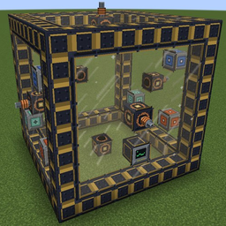
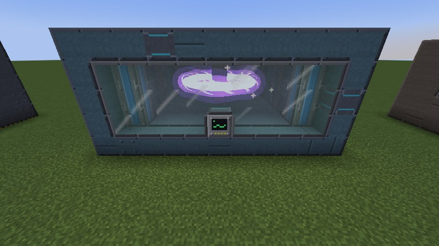
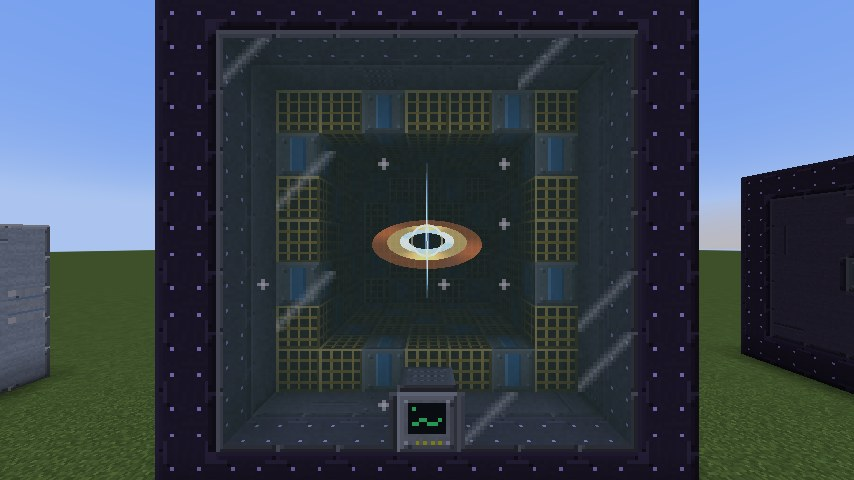
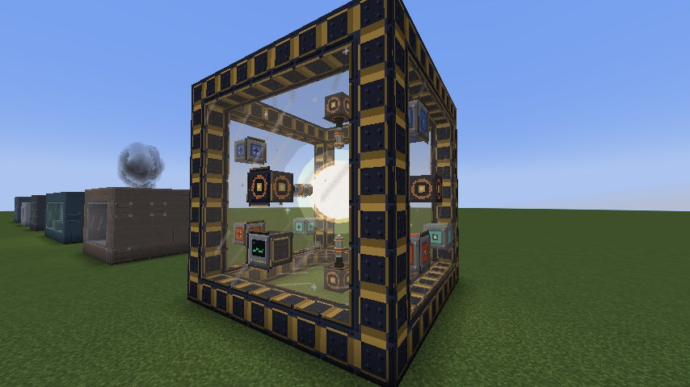
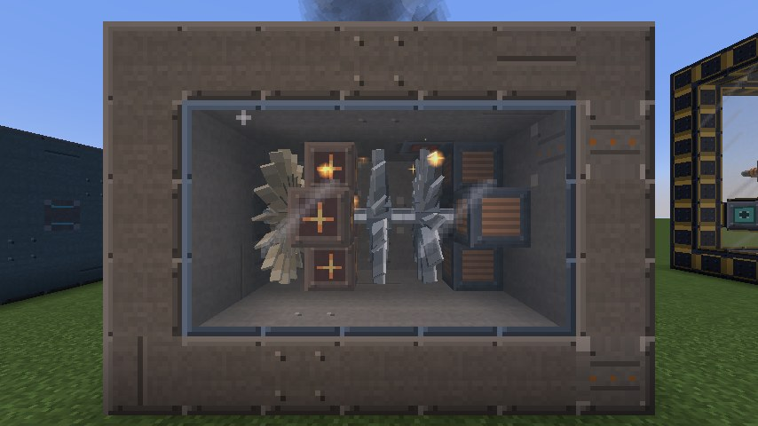
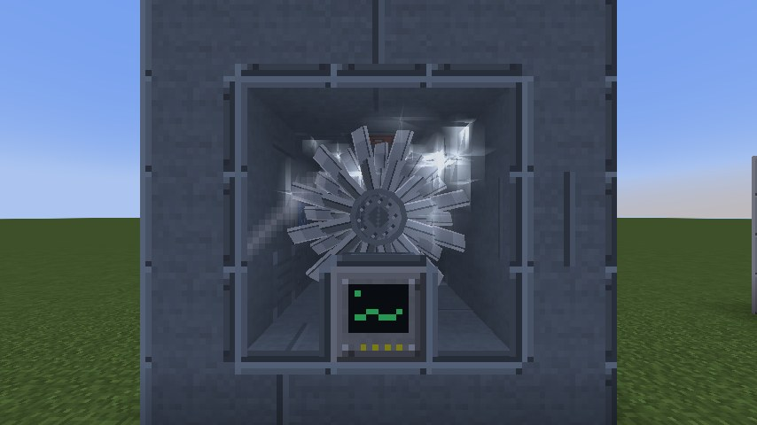
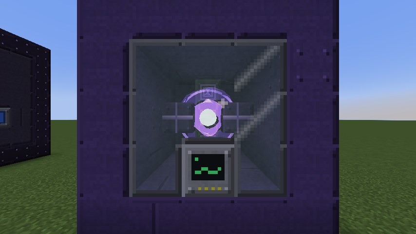

  

<h1 align="center">QuantaVolt</h1>

  Industrial power generation: from a small dynamo to turbines, fission, fusion, an artificial star and black holes. 
  For Fabric and NeoForge.

  <a href="#downloads">Download</a> ·
  <a href="#version-status">Versions</a> ·
  <a href="../../wiki">Wiki</a> ·
  <a href="api/README.md">API for mod developers</a> ·
  <a href="#license">License</a>

This repository holds the documentation, the [wiki](../../wiki), the
[issue tracker](../../issues) and the [API for mod developers](api/README.md). The mod itself
is downloaded from Modrinth or CurseForge. QuantaVolt is not open source; see [License](#license).

  
  
  
  
  
  

## What QuantaVolt is

* **A whole power industry to build:** Basic Dynamo and Stirling generator, Industrial Boiler and Steam Turbine,
  Gasifier, Gas Turbine and Gas Engine (combined cycle through heat ports), solar, solar thermal and wind, fission with
  its own fuel chain (ore, yellowcake, enrichment in a Centrifuge Cascade, fuel rods), tokamak fusion, a Little Star,
  a micro black hole plant and a Hawking radiation reactor.
* **Storage at every scale:** Energy Cell, Capacitor Bank, Battery Hall, Molten-Salt Store, Gravity Store, SMES and a
  Dimensional Store.
* **20 multiblock plants with free sizes:** you choose the size within limits, the controller screen tells you exactly
  which block is wrong and where, and every plant has a step-by-step build guide with in-game pictures of every layer in
  the [wiki](../../wiki).
* **Plants that behave like plants:** rotors with inertia, temperatures, pressures and cooling, warnings before
  anything goes wrong, and incidents if you ignore them. Terrain damage is a server option, and `safeMode` turns every
  incident into a plain shutdown.
* **Computer control:** with CC: Tweaked installed, the plants are peripherals that report their readings and take
  commands.

## Works with other mods

* Items, fluids and energy use the **standard interfaces of the loader** (Fabric Transfer API and Team Reborn Energy;
  NeoForge capabilities). 1 E = 1 FE. Cables and pipes of other mods connect without an extra integration.
* Gases (hydrogen, oxygen, syngas, deuterium, tritium, helium) use the gas system of
  [Pipster](https://modrinth.com/mod/pipster), which is **required**.
* Optional integrations, only active when the other mod is installed: **Jade** (machine status), **JEI** (machine
  recipes), **CC: Tweaked** (computer control). They were started with the real mods on every version where those mods
  exist; see [Supported Versions](../../wiki/Supported-Versions).
* Materials use the common `c:` tags. Checked with Mekanism (uranium, steel; NeoForge 1.21.1) and Tech Reborn (steel; Fabric 1.21.1
  and 26.3); ores also generate in the biomes of Terralith and Biomes O' Plenty (checked on 1.21.1 and 26.3).

## Version status

<!-- VERSION_TABLE -->

"Tested" means, for every listed version: client and dedicated server started, all automated game
tests passed, and the integrations were started with the real mods. The exact loader versions are
listed in the wiki under [Supported Versions](../../wiki/Supported-Versions).

## Performance

Measured on one laptop (Intel Core i7-13700H): a dedicated server with 54 running plants and 168 single machines cost
QuantaVolt 0.4–1.4 ms per tick in the median and at most 2.2 ms in the 99th percentile (Minecraft 1.21.1 and 26.3,
both loaders), out of 50 ms per tick. That is a measurement on that computer, not a promise for every server. Details:
[Performance](../../wiki/Performance).

## Downloads

[Modrinth](https://modrinth.com/project/quantavolt)
[CurseForge](https://www.curseforge.com/minecraft/mc-mods/quantavolt/)

Please download QuantaVolt only from these pages. Pick the file whose name contains your
Minecraft version, for your loader.

## Reporting bugs

Please open an [issue](../../issues/new/choose) with the Minecraft version, the loader and its
version, the jar name, the other mods involved, and `logs/latest.log` (plus a crash report if
there is one).

## License

QuantaVolt is **not open source**. All rights reserved by cptgummiball; see [`LICENSE`](LICENSE).
In short:

* You may play with QuantaVolt, use it on any server and show it in videos and streams.
* You may put QuantaVolt into **modpacks**, as long as the jar files stay exactly as published.
* You may **not** modify, decompile, re-upload or otherwise redistribute QuantaVolt, or use its
  assets elsewhere.
* Mod developers may compile against the [QuantaVolt API](api/README.md).
* For anything else, open a [permission request](../../issues/new?template=permission_request.yml).

QuantaVolt is made by **cptgummiball**. It is not an official Minecraft product and is not
associated with Mojang or Microsoft.
